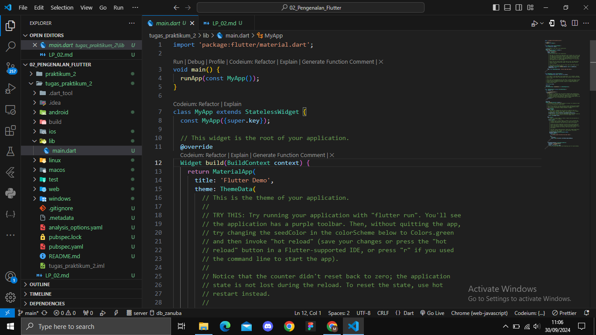
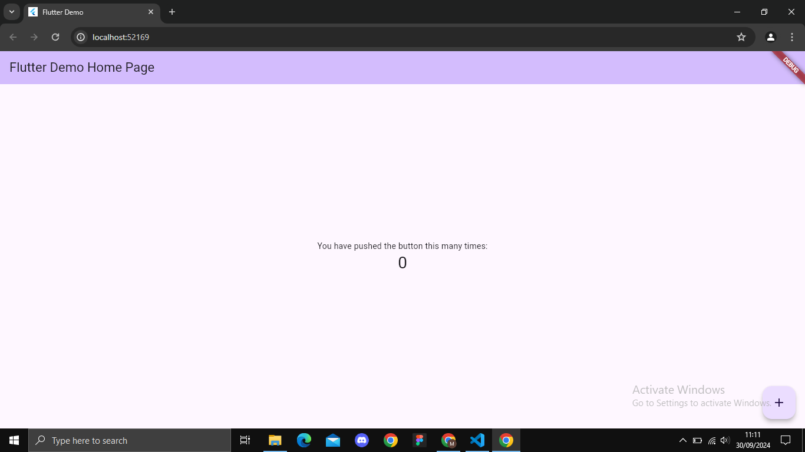
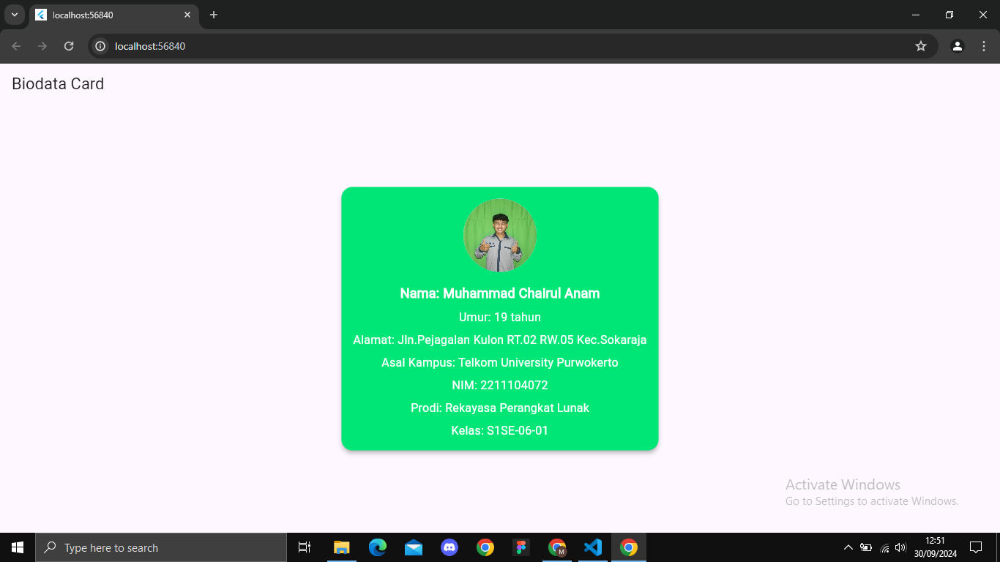

# 1.  apa itu Dart & Flutter beserta contoh widget yang ada pada Flutter.
jawab: 
Dart adalah bahasa pemrograman yang dibuat oleh google
Flutter adalah framework atau kerangka kerja yang bersifat open source yang di kembangkan dan didukung oleh google untuk membangun antarmuka pengguna (UI)

contoh :
<li>Stateless Widget & Stateful Widget
<li>Scaffold
<li>Container
<li>Padding
<li>Center
<li>Row & Column

# 2. Buatlah sebuah project Flutter.
jawab : 

# 3. Setelah project dibuat, jalankan di emulator atau pada real device (jika pada tampilan telah keluar project Flutter seperti gambar di bawah, maka telah berhasil).
jawab :

# 4. Setelah berhasil, modifikasi halaman diatas untuk menampilkan biodata kalian, minimal 5 widget!! (bebas, buatlah sekreatif mungkin).
jawab :

